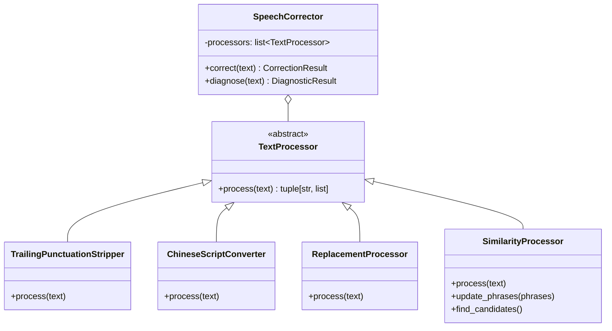

# Contributing to STT Corrector for Home Assistant

Thank you for considering contributing to this project. This guide covers the development setup, testing, and submission process.

## Prerequisites

- Python 3.14+
- [uv](https://docs.astral.sh/uv/) package manager
- A Home Assistant instance (for integration testing)

## Development Setup

```bash
git clone https://github.com/hass-cortex/stt-corrector.git
cd stt-corrector
uv sync --group dev --group test
```

## Running Tests

```bash
# Run all tests
uv run pytest tests/ -v

# Run with coverage report
uv run pytest tests/ --cov=custom_components --cov-report=term-missing

# Run a specific test file
uv run pytest tests/test_stt.py -v
```

## Code Style

This project enforces consistent code style via automated tooling:

- **Linting**: `uv run ruff check .`
- **Formatting**: `uv run ruff format .`
- **Type checking**: `uv run mypy custom_components/`
- Follow Google-style docstrings for all public functions and classes

## Commit Convention

Use [Conventional Commits](https://www.conventionalcommits.org/):

| Prefix | Use case |
|--------|----------|
| `feat:` | New feature |
| `fix:` | Bug fix |
| `docs:` | Documentation only |
| `chore:` | Maintenance / tooling |
| `refactor:` | Code restructure without behavior change |
| `test:` | Adding or updating tests |

Example: `feat: add Japanese phonetic matcher`

## Submitting Changes

1. Fork the repository
2. Create a feature branch from `main`
3. Make your changes with appropriate tests
4. Ensure all checks pass (`ruff check`, `ruff format --check`, `pytest`)
5. Submit a pull request with a clear description of the change

## Project Structure

```
stt-corrector/
  custom_components/stt_corrector/
    __init__.py          # Integration setup (pypinyin preload, platform forwarding)
    stt.py               # Proxy STT entity (wraps any STT provider with correction)
    sensor.py            # Correction statistics sensors (RestoreSensor)
    models.py            # Runtime data models (STTCorrectorRuntimeData)
    config_flow.py       # Config flow (select wrapped STT entity) + menu-based options
    correction_config.py # CorrectionConfig dataclass
    helpers.py           # Entity lookup helpers
    phrase_builder.py    # HA registry phrase collection for fuzzy matching
    services.py          # HA service handlers
    const.py             # Constants, defaults, config keys
    correction/          # Language-agnostic correction pipeline
      corrector.py         # SpeechCorrector (pipeline orchestrator)
      fuzzy_matcher.py     # Sliding window + similarity scoring
      matchers.py          # PhoneticMatcher ABC + DefaultMatcher
      types.py             # CorrectionMethod, CorrectionChange, CorrectionResult, DiagnosticResult
      processors/          # TextProcessor subclasses (all pipeline processors)
        base.py              # TextProcessor ABC
        punctuation.py       # TrailingPunctuationStripper
        replacement.py       # ReplacementProcessor
        similarity.py        # SimilarityProcessor
      languages/           # Language module framework
        __init__.py          # LanguageModule ABC + normalize_locale()
        registry.py          # LanguageModuleRegistry
        mandarin.py          # MandarinModule + PinyinMatcher + ChineseScriptConverter
  tests/                 # Test suite
  pyproject.toml         # Project metadata and tool config
```

## Architecture

### Pipeline

The correction pipeline is a list of `TextProcessor` instances executed in order by `SpeechCorrector`. Each processor transforms text and reports changes.



### Language Module Framework

Each supported language is a self-contained module providing:
- **Processors**: Text normalization operations (punctuation stripping, script conversion)
- **Matcher**: A phonetic matching strategy for similarity comparison
- **Configuration schema**: Per-locale settings with defaults, shown in the Language Settings menu

Currently, the only language module is **Mandarin Chinese** (`zh-TW`, `zh-HK`, `zh-CN`).

### Locale Handling

HA voice pipelines and STT engines may send locale codes in different formats (`zh-TW`, `zh_tw`, `zh_TW`, `zh-tw`). The integration normalizes all locale codes to lowercase with hyphen separator (e.g., `zh-tw`) using `normalize_locale()` from `correction.languages`. Always use this function when comparing or looking up locales -- do not use `.lower()` alone.

## Adding a New Language Module

To add processing and phonetic matching for a new language:

1. **Create the module** in `correction/languages/<language>.py` -- subclass `LanguageModule` and implement all abstract methods (see `mandarin.py` as a reference)
2. **Register the module** in `correction/languages/registry.py` -- add an instance to `LanguageModuleRegistry._modules`
3. **Add a config flow step** in `config_flow.py` -- add an `async_step_lang_<key>` method that delegates to `_handle_language_step`
4. **Add UI strings** in `strings.json` and `translations/en.json` for the new step (these files must stay in sync)
5. **Write tests** for the new module

See the [AGENTS.md](AGENTS.md#adding-a-new-language-module) for a detailed step-by-step guide with code templates.

## Reporting Issues

Please use GitHub Issues with the provided templates. Include:

- Home Assistant version
- Integration version
- Steps to reproduce
- Expected vs actual behavior
- Relevant debug logs (see README for how to enable debug logging)
