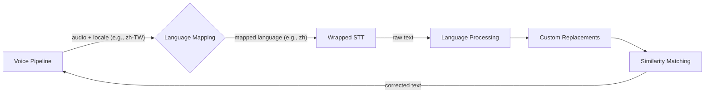
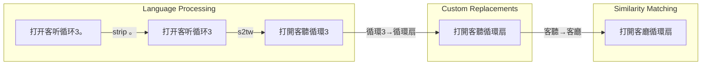

# How It Works

STT Corrector sits between your voice pipeline and your actual STT provider. It does not modify the STT engine itself -- it corrects the text *after* transcription.

## The Correction Pipeline

Each processor can be enabled or disabled independently in the **Active Processors** menu. All three are enabled by default. Disabled processors are skipped -- other processors continue to run normally.



### STT Language Mapping

Before audio reaches the wrapped STT engine, the corrector checks if the requested locale needs language mapping. This allows you to use locale variants (e.g., `zh-TW`) in your voice pipeline even when the underlying STT engine only supports a generic language code (e.g., `zh`).

**How it works:**
1. The voice pipeline sends audio with a locale (e.g., `zh-TW`)
2. The corrector looks up the **STT Language** mapping for that locale
3. If a mapping exists and differs from the locale, the corrector forwards the audio to the STT engine with the mapped language (e.g., `zh`)
4. The STT engine transcribes the audio using its native language support
5. The corrector runs the locale-specific correction pipeline (e.g., zh-TW script conversion) on the result

**Auto-computed defaults:** When you haven't explicitly configured a mapping, the corrector auto-detects a match using prefix matching (e.g., `zh-TW` matches `zh` in the STT engine's supported languages). These locales automatically appear in your voice pipeline's language dropdown.

**Three states per locale:**
| State | Behavior |
|-------|----------|
| Not configured (default) | Auto-compute via prefix matching. If the STT engine supports `zh`, all Chinese locales are available. |
| Mapped to a language (e.g., `zh`) | Explicitly enabled. Audio is forwarded with the mapped language. |
| Set to "Disabled" (empty) | Locale is hidden from the voice pipeline. |

You can configure mappings in **Language Settings > \<Language\> > \<Locale\> > STT Language**.

### Language Processing

Applies locale-specific text normalization. The integration selects the appropriate language module based on the audio locale sent by the voice pipeline (the original locale, not the mapped STT language).

**Currently supported: Chinese (zh-TW, zh-HK, zh-CN)**

For Chinese locales, two processors run in order:

1. **Trailing punctuation stripping** -- Removes sentence-ending punctuation (like `。`) that STT engines sometimes append to voice commands. These characters are meaningless for home automation commands and can interfere with later matching.

2. **Script conversion** -- Converts between simplified and traditional Chinese using [OpenCC](https://github.com/BYVoid/OpenCC). Each locale can choose any conversion mode from the dropdown:

   | Mode | Direction | Description |
   |------|-----------|-------------|
   | s2tw | Simplified → Traditional | Taiwan standard |
   | s2hk | Simplified → Traditional | Hong Kong variant |
   | t2s | Traditional → Simplified | Generic conversion |
   | Off | — | Disabled |

   **Defaults:** zh-TW uses `s2tw`, zh-HK uses `s2hk`, zh-CN is off. These can be changed per locale in Language Settings.

**Other languages**: No built-in language processing yet. The framework is extensible -- new languages can be added by implementing a `LanguageModule`.

### Custom Replacements

Applies user-defined `wrong=correct` text substitution rules. Rules are applied in longest-key-first order to prevent partial matches from interfering with longer ones.

**Example rules:**
```
livin room=living room
kichen=kitchen
bed rom=bedroom
```

With these rules, `"turn on the kichen light"` becomes `"turn on the kitchen light"`.

If you have rules for both `大門鎖` and `大門鎖定`, the longer key `大門鎖定` matches first.

Custom replacements are best for words that your STT engine *consistently* gets wrong in the same way. For occasional or varied errors, Similarity Matching is more effective.

### Similarity Matching

Compares segments of the transcribed text against a vocabulary of known phrases using a sliding window approach. When a segment is similar enough to a known phrase (above the configured threshold), it gets replaced.

The matching strategy depends on the language:

| Language | Matching method | How it works |
|----------|----------------|--------------|
| Chinese (zh-TW, zh-HK, zh-CN) | Pinyin comparison | Converts characters to romanized pronunciation, compares syllable by syllable with tone awareness and similar-initial boosting |
| All other languages | SequenceMatcher | Standard fuzzy string comparison with word-boundary-aware sliding windows |

**Pinyin matching details**: The matcher converts both the input segment and each known phrase to pinyin syllables, then scores them based on:
- Exact syllable match (same base + same tone): 1.0
- Same base, different tone: 0.85 (tone differences are common STT errors)
- Similar initial consonant with same final (e.g., l/n, zh/z, sh/s): 0.70+
- Different syllable count (more than 1 apart): 0.0 (not the same phrase)

**Known phrases** are built from two sources:
- **Auto-collected**: Friendly names of exposed entities, device names, area names, and floor names from your HA registries (each source can be toggled independently)
- **Custom phrases**: Any additional phrases you add manually

**Threshold**: The similarity score (0.5--1.0) controls how strict matching is. Lower values catch more errors but risk false corrections. The default of 0.8 works well for most setups.

**Exclusions**: Words or phrases on the exclusion list are never corrected by similarity matching. Use this for words that are similar to device names but should not be changed (e.g., "pocket" is close to "socket").

**Exclusion scope:** Exclusions only prevent corrections from Similarity Matching. Language Processing and Custom Replacements are not affected by the exclusion list.

## Worked Examples

### Chinese (zh-TW): Full pipeline

Voice command: User says "turn on the living room circulation fan" in Mandarin. The HA area is `客廳`, device is `循環扇`, and the user has a custom replacement rule `循環3=循環扇` because STT consistently misrecognizes `扇`(shàn) as `3`(sān).

STT engine output: `打开客听循环3。` (simplified Chinese, wrong character `听`(聽) instead of `厅`(廳), `3` instead of `扇`, trailing period)



```
Language Processing:
  Punctuation strip: "打开客听循环3。" -> "打开客听循环3"   (removed 。)
  Script conversion: "打开客听循环3"   -> "打開客聽循環3"   (s2tw: character-level)

Custom Replacements:
  Rule "循環3=循環扇" matched -> "打開客聽循環扇"

Similarity Matching:
  "客聽" pinyin: ["ke4", "ting1"]
  Area name "客廳" pinyin: ["ke4", "ting1"]
  Score: 0.85 (same pinyin, different characters) -> accepted
  Result: "打開客廳循環扇"

Final result: "打開客廳循環扇"
```

### English: Fuzzy matching corrects a misheard name

Voice command: User says "turn off living room light."

STT engine output: `turn off livin room lite`

```
Language Processing:
  No English processors configured -> "turn off livin room lite" (unchanged)

Custom Replacements:
  No matching rules -> "turn off livin room lite" (unchanged)

Similarity Matching:
  Sliding window finds "livin room lite"
  Known phrase "living room light" scores 0.88 (above 0.8 threshold) -> accepted
  Result: "turn off living room light"

Final result: "turn off living room light"
```

### Chinese (zh-TW): Pinyin catches a homophone

Voice command: User says "turn on the AC" in Mandarin. The HA device is named `冷氣`, but STT picks a homophone.

STT engine output: `打開冷器` (wrong character `器` instead of `氣`, same pronunciation)

```
Language Processing:
  No trailing punctuation -> "打開冷器" (unchanged)
  Already traditional script -> "打開冷器" (unchanged)

Custom Replacements:
  No matching rules -> "打開冷器" (unchanged)

Similarity Matching:
  "冷器" pinyin: ["leng3", "qi4"]
  Known phrase "冷氣" pinyin: ["leng3", "qi4"]
  Score: 1.0 (exact pinyin match) -> accepted
  Result: "打開冷氣"

Final result: "打開冷氣"
```
